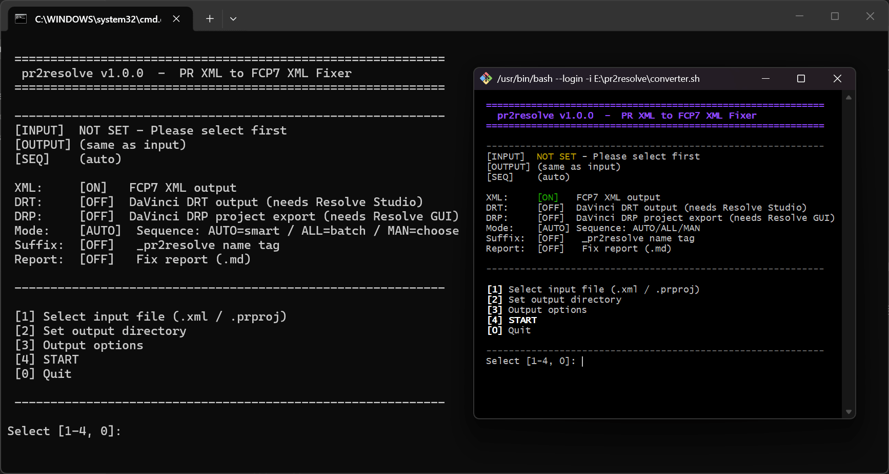

<div align="center">

> **Current Status: Stable**  
> *v1.0.1 — try/finally orphan cleanup*

# .PRPROJ-.DRT Converter

Premiere Pro 转 DaVinci Resolve 的时间线转换器。输出 FCP7 XML、DRT 和 DRP。

[**README in English**](README_EN.md)



</div>

---

<!-- omit from toc -->
## 目录

- [使用前准备工作](#使用前准备工作)
- [快速开始](#快速开始)
  - [Windows](#windows)
  - [macOS / Linux](#macos--linux)
  - [TUI内操作](#tui内操作)
  - [CLI](#cli)
- [俺の主要功能](#俺の主要功能)
- [俺の起源](#俺の起源)
- [CLI 参数](#cli-参数)
- [工作原理](#工作原理)
- [修正规则](#修正规则)
- [已知限制](#已知限制)
- [参考](#参考)
- [License](#license)

---

## 使用前准备工作

1. **安装 Python 3**（要求 3.8 及以上）  
   - 从 [python.org](https://www.python.org/downloads/) 下载安装包  
   - **关键**：安装时务必勾选 `Add Python to PATH`（添加到环境变量）  
   - 若已安装但未加 PATH，可重新运行安装程序勾选修复

2. **验证安装**  
   打开终端（cmd 或 bash），输入以下命令不报错即可：
   ```bash
   python --version
   ```

---

## 快速开始

下载[最新版本源码压缩包]()，解压。

### Windows

双击 `converter.bat`。

### macOS / Linux

```bash
chmod +x converter.sh
./converter.sh
```


### TUI内操作

```bash
输入相应数字选择功能：
[1] 选择输入文件 (.xml 或 .prproj)
[2] 设置输出目录
[3] 配置选项 (XML / DRT /DRP / Report)
[4] 开始转换
[0] 退出
```

### CLI

```bash
# 修正 PR 导出的 XML
python pr2resolve.py "input.xml"

# 直接从 .prproj 解析（推荐）
python pr2resolve.py "project.prproj" -o ./output

# 指定序列名
python pr2resolve.py "project.prproj" --sequence "序列 01"

# DRT 输出（需要达芬奇 Studio 运行中）
python pr2resolve.py "input.xml" --drt

# DRP 后台导出（自动启动达芬奇，导出后关闭）
python pr2resolve.py "project.prproj" --drp

# DRP 交互式导出（打开达芬奇 GUI，项目保持打开）
python pr2resolve.py "project.prproj" --drp-gui

# 生成修正报告
python pr2resolve.py "input.xml" --report

# 只看不改
python pr2resolve.py "input.xml" --diagnose-only
```

导出的 XML 在达芬奇中导入：

```
File → Import Timeline → Import AAF, EDL, XML... → 选择 .xml 文件
```

---

## 俺の主要功能

**pr2resolve 读入 PR 的时间线数据，输出达芬奇能直接用的文件。（或者直接在达芬奇打开）**

两种输入都能吃：
- PR 导出的 FCP7 XML (.xml)
- PR 自己的工程文件 (.prproj) — **推荐用这个**，数据最全

两种输出都支持：
- FCP7 XML — 什么依赖都不要，任何达芬奇版本都能导入
- DRT — 需要达芬奇 Studio 配合，能保留 Lumetri 调色、变速曲线等 XML 装不下的东西

---

## 俺の起源

**源自我的实际回批PR的糟糕体验还有网络大家都在吐槽的数据问题，PR 导出 FCP7 XML 给达芬奇用是出了名的一言难尽。经过调查发现：**

- **Scale 值全是 100%。**

    PR 里缩放好的画面，XML 里写的是 Scale=100%。到那边素材比屏幕还大，一个一个手动算修正值。

- **Lumetri 调色无法转换。**

    XML 里你的调色是一坨 base64 编码。达芬奇不认识，直接跳过，还会导致达芬奇崩溃（实测能打开，但涉及更改时间线的事会直接无响应，可能是出错导致IO进程堆积而崩溃。）

- **不认路径格式，素材离线。**

    PR 导出 `file://localhost/C%3a/Users/...`，达芬奇不认这个格式。只能 relink。

**pr2resolve 读进去，把这些问题全修完，输出干净的 FCP7 XML 。**

- **为什么推荐用 .prproj 而不是导出 XML？**

    PR 自带的 XML 导出是二次加工过的——PR 先生成一份删减版 XML，拿到的数据已经失真。.prproj 是 PR 自己保存的工程文件（gzip 压的 XML），Lumetri 参数、变速曲线、关键帧全在里面。直接给 .prproj 就行，没必要先导出 XML 再修。

- **DRT 是什么时候用的？**

    在 PR 做了大量调色，不想在达芬奇重调一遍。DRT 走达芬奇的 Scripting API，把 Lumetri 参数直接写进 Color Corrector 节点。需要达芬奇 Studio 开着。

---

## CLI 参数

| 参数 | 类型 | 说明 |
|------|------|------|
| `input` | Path | 输入文件 (.xml 或 .prproj) |
| `-o`, `--output` | Path | 输出目录（默认：和输入文件同目录） |
| `--report` | flag | 生成修正报告 (.md) |
| `--drt` | flag | 生成 DRT 输出（需达芬奇 Studio） |
| `--sequence` | str | 指定 .prproj 中的序列名（默认自动选） |
| `--diagnose-only` | flag | 只诊断不修正 |
| `--version` | flag | 显示版本号 |

---

## 工作原理

```
输入 (.xml 或 .prproj)
    │
    ├─ XML → ElementTree 结构化解析
    ├─ .prproj → gzip 解压 → ObjectID 图遍历
    │
    ▼
扫描 21 项已知问题 → 按严重级别自动修 → 23 项合规验证
    │
    ▼
输出:
    ├─ output.xml   ← 修正后的 FCP7 XML（始终输出）
    ├─ output.md    ← 修正报告（--report 时）
    └─ output.drt   ← 达芬奇原生时间线（--drt 时，需达芬奇运行）
```

---

## 修正规则

| 级别 | 规则 | 说明 |
|------|------|------|
| C0 | version | `xmeml version="4"` → `"5"` |
| C1-C2 | format | 补全 video/audio `<format>` |
| C3-C4 | rate | 补全 `<ntsc>` / `<timebase>` |
| C5 | pathurl | `file://localhost/...` → `file:///...` |
| C6 | media 顺序 | video 移到 audio 前面 |
| M0 | Lumetri | XML: 删除；DRT: 映射到 Color 节点 |
| M1-M2 | clipid/track | 补全 `<masterclipid>` / `<sourcetrack>` |
| M4 | link | 同源素材生成 `<link>` |
| M5 | file details | 补全 `<file>` 的 samplecharacteristics |
| M6 | 元素顺序 | clipitem 子元素按 FCP7 规范排序 |
| M7 | Scale | 源分辨率 / 时间线分辨率 = fit scale |
| N1-N7 | 细节 | timecode / 浮点精度 / 帧率一致性 / displayformat / 等 |

所有规则自动应用，不给用户开关。因为这些修正是必要的——不修就导不进达芬奇或画面出错。用户只需决定输入什么、输出到哪、输出什么格式。

---

## 已知限制

1. **PR 文字标题** — 导入达芬奇后常为空。FCP7 XML 自身的限制，不可修。
2. **嵌套序列** — 经常展平或导入失败。
3. **素材搬了家** — XML 写绝对路径，素材移动后得在达芬奇 relink。
4. **达芬奇导入设置** — 建议取消 "Use sizing information"，免得被缩两次。
5. **免费版达芬奇** — Scripting API 是 Studio 专属，DRT 用不了。XML 不影响。
6. **Lumetri 不能完美还原** — XML 路径删 Lumetri。DRT 路径基本参数（曝光/对比度/高光/阴影/色温等）可映射到 Color 节点。Vignette、Sharpen 只能近似。

---

## 参考

- [PRPROJ-READER](https://github.com/sergeiventurinov/PRPROJ-READER) — .prproj 格式逆向
- [prproj_downgrade](https://github.com/snorkem/prproj_downgrade) — .prproj 版本降级工具
- [ppro-scripting](https://ppro-scripting.docsforadobe.dev) — Adobe 对象模型文档
- [DaVinci Resolve Scripting API](https://resolvedevdoc.readthedocs.io/) — 达芬奇 API 参考1
- [DaVinci Resolve Scripting API](https://weijer.github.io/davinci-resolve-api/#/) — 达芬奇 API 参考2
- [DaVinci Resolve MCP](https://github.com/samuelgursky/davinci-resolve-mcp) — 达芬奇 MCP 开源项目

---

## License

[MIT LICENSE](./LICENSE)
