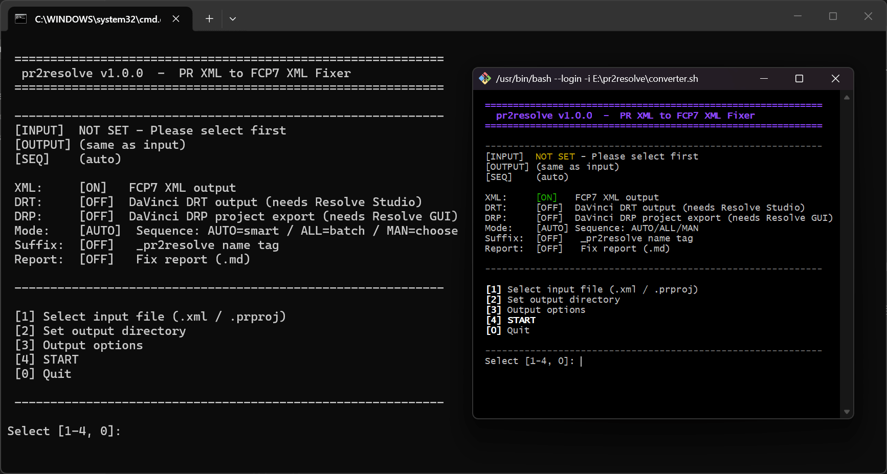

<div align="center">

> **Current Status: Stable**  
> *v1.0.3 — native PRPROJ timelines, source timecode, DRP, and TUI entry polish*

# .PRPROJ-.DRT Converter

Premiere Pro 转 DaVinci Resolve 的时间线转换器。输出 FCP7 XML、DRT 和 DRP。

[**README in English**](README_EN.md)



</div>

---

<!-- omit from toc -->
## 目录

- [快速开始](#快速开始)
  - [Windows](#windows)
  - [macOS](#macos)
  - [Linux](#linux)
  - [源码运行](#源码运行)
- [使用前准备工作](#使用前准备工作)
  - [TUI内操作](#tui内操作)
  - [CLI](#cli)
- [主要功能](#主要功能)
- [项目背景](#项目背景)
- [CLI 参数](#cli-参数)
- [工作原理](#工作原理)
- [修正规则](#修正规则)
- [已知限制](#已知限制)
- [参考](#参考)
- [License](#license)

## 快速开始

普通用户优先下载 [最新 Release](https://github.com/Ersiter/pr2resolve/releases/latest) 中对应平台的压缩包。Release 包自带可执行文件，不需要安装 Python。

### Windows

下载 `pr2resolve-v*-windows-x86_64.zip`，解压后双击 `pr2resolve.exe`，进入交互式 TUI。

### macOS

下载 `pr2resolve-v*-macos-*.tar.gz`，解压后运行：

```bash
tar -xzf pr2resolve-v*-macos-*.tar.gz
chmod +x pr2resolve
./pr2resolve
```

如果 macOS 阻止未签名二进制，请在系统安全设置中允许本次运行，或按你的本机安全策略处理。

### Linux

下载 `pr2resolve-v*-linux-*.tar.gz`，解压后运行：

```bash
tar -xzf pr2resolve-v*-linux-*.tar.gz
chmod +x pr2resolve
./pr2resolve
```

### 源码运行

需要改代码、调试或不使用 Release 包时，再使用源码运行。源码运行需要 Python 3.10+。

Windows：

```bat
converter.bat
```

macOS / Linux：

```bash
chmod +x converter.sh
./converter.sh
```

也可以直接使用 CLI：

```bash
python pr2resolve.py "project.prproj" -o ./output
```

---

## 使用前准备工作

- **Release 包用户**：不需要安装 Python。
- **源码运行用户**：需要 Python 3.10+。Windows 安装时建议勾选 `Add Python to PATH`。
- **可靠 `.prproj` 转换**：三平台都建议安装 FFmpeg，并确保 `ffprobe` 在 `PATH` 中可用。`ffprobe` 不是 Python 包。
- **构建维护者**：官方 Release 二进制使用 Python 3.14、Nuitka、UPX 和平台编译工具链构建。Python 构建依赖见 `requirements-build.txt`。

`ffprobe` 缺失时 pr2resolve 仍会尝试导出，但 `.prproj` 源素材 timecode、帧率和完整时长检测可能不完整，容易导致片段错位、素材离线或时间线异常。

验证源码和 `ffprobe` 环境：

```bash
python --version
ffprobe -version
```

---

### TUI内操作

```
输入相应数字选择功能：
[1] 选择输入文件 (.xml 或 .prproj)
[2] 设置输出目录
[3] 配置选项 (XML / DRT / DRP / Mode / Suffix / Report)
[4] 开始转换
[0] 退出
```

### CLI

```bash
# 修正 PR 导出的 XML
python pr2resolve.py "input.xml"

# 直接从 .prproj 解析（推荐）
python pr2resolve.py "project.prproj" -o ./output

# 指定序列名
python pr2resolve.py "project.prproj" --sequence "序列 01"

# 导出所有非空序列
python pr2resolve.py "project.prproj" --all-sequences

# DRT 输出（需要达芬奇 Studio 运行中）
python pr2resolve.py "input.xml" --drt

# DRP 后台导出（所有非空序列，headless）
python pr2resolve.py "project.prproj" --drp

# DRP 交互式导出（GUI，工程保持打开）
python pr2resolve.py "project.prproj" --drp-gui

# 生成修正报告
python pr2resolve.py "input.xml" --report

# 只看不改
python pr2resolve.py "input.xml" --diagnose-only
```

导出的 XML 在达芬奇中导入：

```
File → Import Timeline → Import AAF, EDL, XML... → 选择 .xml 文件
```

---

## 主要功能

**pr2resolve 读取 Premiere Pro 时间线数据，输出 DaVinci Resolve 可直接使用的文件。**

两种输入格式：
- PR 导出的 FCP7 XML (.xml)
- PR 工程文件 (.prproj) — **推荐**，数据最完整

三种输出格式：
- FCP7 XML — 零依赖，所有达芬奇版本均可导入
- DRT — 需达芬奇 Studio，可通过 Resolve API 导出时间线并补充部分 Lumetri 参数
- DRP — 达芬奇工程导出，包含所有非空序列的完整项目结构

---

## 项目背景

**源自 Premiere Pro 到 DaVinci Resolve 的实际回批经验及社区广泛反馈。PR 的 FCP7 XML 导出存在以下已知缺陷：**

- **Scale 值全部显示为 100%。**

    PR 中缩放好的画面，XML 中写为 Scale=100%。导入达芬奇后素材尺寸远大于画面，需逐一手动计算修正值。

- **Lumetri 调色信息丢失。**

    XML 中调色数据以 base64 编码存储。达芬奇无法识别，直接跳过，且可能在操作时间线时导致无响应（疑似解析错误致使 I/O 进程堆积）。

- **路径格式不兼容，素材离线。**

    PR 导出的路径格式为 `file://localhost/C%3a/Users/...`，达芬奇不识别此格式，仅能通过 relink 恢复。

**pr2resolve 读取输入后自动修正上述问题，输出干净的 FCP7 XML。**

- **为什么推荐 .prproj 而非导出 XML？**

    PR 自带的 XML 导出是二次加工——先生成删减版 XML 再输出，数据已失真。.prproj 是 PR 原生工程文件（gzip 压缩的 XML），可提供更多时间线、素材和效果上下文。直接提供 .prproj 即可，无需先导出 XML 再修正。

- **DRT 的使用场景？**

    已在 PR 中完成大量调色，不希望到达芬奇后重做。DRT 通过达芬奇 Scripting API 将 Lumetri 参数直接写入 Color Corrector 节点。需要达芬奇 Studio 保持运行。

---

## CLI 参数

| 参数 | 类型 | 说明 |
|------|------|------|
| `input` | Path | 输入文件 (.xml 或 .prproj) |
| `-o`, `--output` | Path | 输出目录（默认：与输入文件同目录） |
| `--report` | flag | 生成修正报告 (.md) |
| `--drt` | flag | 生成 DRT 输出（需达芬奇 Studio） |
| `--drp` | flag/path | 后台导出 DRP（所有非空序列） |
| `--drp-gui` | flag/path | 交互式导出 DRP（所有非空序列） |
| `--all-sequences` | flag | 导出 .prproj 中全部非空序列 |
| `--sequence` | str | 指定 .prproj 中的序列名 |
| `--no-suffix` | flag | 输出文件名不加 `_pr2resolve` 后缀 |
| `--no-xml` | flag | 跳过 FCP7 XML 输出（仅 --drt 或 --drp 时） |
| `--diagnose-only` | flag | 仅诊断，不修正 |
| `--version` | flag | 显示版本号 |

---

## 工作原理

```
输入 (.xml 或 .prproj)
    │
    ├─ XML → ElementTree 结构化解析
    ├─ .prproj → gzip 解压 → ObjectID 图遍历
    │
    ▼
扫描 21 项已知问题 → 按严重级别自动修正 → 23 项合规验证
    │
    ▼
输出:
    ├─ output.xml   ← 修正后的 FCP7 XML（默认输出）
    ├─ output.md    ← 修正报告（--report 时）
    ├─ output.drt   ← 达芬奇原生时间线（--drt 时，需达芬奇运行）
    └─ output.drp   ← 达芬奇工程导出（--drp / --drp-gui 时）
```

---

## 修正规则

| 级别 | 规则 | 说明 |
|------|------|------|
| C0 | version | `xmeml version="4"` → `"5"` |
| C1-C2 | format | 补全 video/audio `<format>` |
| C3-C4 | rate | 补全 `<ntsc>` / `<timebase>` |
| C5 | pathurl | `file://localhost/...` → `file:///...` |
| C6 | media 顺序 | video 移到 audio 前面 |
| M0 | Lumetri | XML: 删除；DRT: 映射到 Color 节点 |
| M1-M2 | clipid/track | 补全 `<masterclipid>` / `<sourcetrack>` |
| M4 | link | 同源素材生成 `<link>` |
| M5 | file details | 补全 `<file>` 的 samplecharacteristics |
| M6 | 元素顺序 | clipitem 子元素按 FCP7 规范排序 |
| M7 | Scale | 源分辨率 / 时间线分辨率 = fit scale |
| N1-N7 | 细节 | timecode / 浮点精度 / 帧率一致性 / displayformat 等 |

所有规则自动应用，不提供开关。这些修正是必需的——不修正将导致导入失败或画面错误。

---

## 已知限制

1. **PR 文字标题** — 导入达芬奇后常为空。FCP7 XML 自身限制，无法修正。
2. **嵌套序列** — 经常被展平或导入失败。
3. **素材移动** — XML 存储绝对路径，素材搬移后需在达芬奇 relink。
4. **达芬奇导入设置** — 建议取消 "Use sizing information"，避免双重缩放。
5. **免费版达芬奇** — 本项目的 DRT/DRP 路径按 DaVinci Resolve Studio 验证；免费版不作为支持目标。XML 不受影响。
6. **Lumetri 不能完美还原** — XML 路径直接删除 Lumetri。DRT 路径可映射基本参数（曝光/对比度/高光/阴影/色温等）到 Color 节点；Vignette、Sharpen 等仅能近似。

---

## 参考

- [PRPROJ-READER](https://github.com/sergeiventurinov/PRPROJ-READER) — .prproj 格式逆向
- [prproj_downgrade](https://github.com/snorkem/prproj_downgrade) — .prproj 版本降级工具
- [ppro-scripting](https://ppro-scripting.docsforadobe.dev) — Adobe 对象模型文档
- [DaVinci Resolve Scripting API](https://resolvedevdoc.readthedocs.io/) — 达芬奇 API 参考
- [DaVinci Resolve MCP](https://github.com/samuelgursky/davinci-resolve-mcp) — 达芬奇 MCP 开源项目

---

## License

[MIT LICENSE](./LICENSE)
